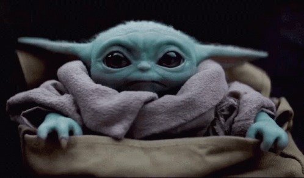

<h1 align="center">Hey 👋, I'm Devesh Todarwal</h1>

## 🐼 About Me
I'm currently studying at [**BITS Pilani**](https://www.bits-pilani.ac.in/), and I work as a Research Intern with [**Samsung Research**](https://research.samsung.com/sri-b). My current work lies in the domain of AI for Automatic Speech Recognition. I am also exploring the working of [**Transformers**](https://medium.com/inside-machine-learning/what-is-a-transformer-d07dd1fbec04) and their utility for [time-series data](https://arxiv.org/pdf/1907.05321.pdf) alongside occasional stints of Web development!
 

- 🌱 Currently learning **JavaScript** and **RUST**
- 📚 Currently reading [*Gödel, Escher, Bach: an Eternal Golden Braid*](https://www.theatlantic.com/magazine/archive/2013/11/the-man-who-would-teach-machines-to-think/309529/)
- 🎵 On loop: *[If I Go, I'm Goin](https://music.youtube.com/watch?v=BKc4I_cK0JU&feature=share)*
- 🧠 Currently researching in the domain of **Automatic Speech Recognition** and **Brain-Computer Interface**
- 💬 Tech that I'd love to discuss - **NLP, CV, E2E ASR, Product Development, Micro-SaaS and Algorithmic trading**
- 🧶 I also love - **Football, Linkin Park, Puns and Agatha Christie**
- 📫 Have a question? Reach me at **todarwal.devesh@gmail.com**
***
## 🧰 My Toolbox

### Languages:

   

### Frameworks and Other Tools:

     

***
## 💡 My Github Stats

